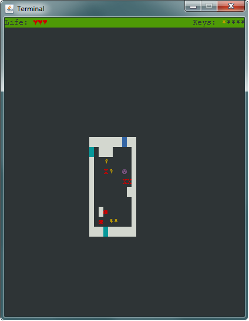

# tum-labyrinth

This game is the result of a programming project of the first semester
at the Technical University in Munich, Germany.

This project is licenses under the MIT license. It makes use of the
[lanterna](https://code.google.com/p/lanterna/) library which is LGPL
licensed.
